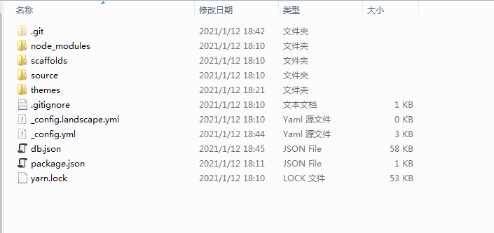
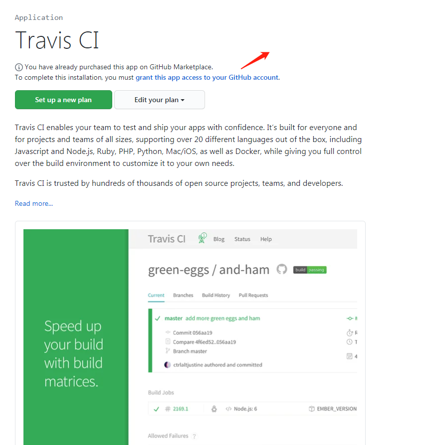
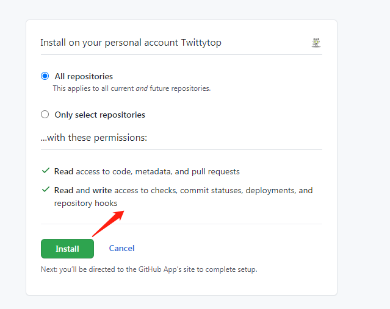
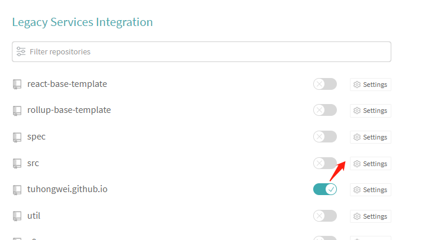
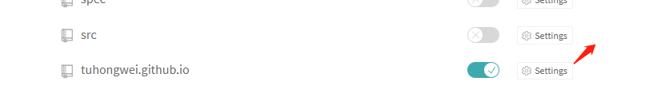

### 写在前面

本文也适合有搭建博客需求的非技术人员，不需要服务器，不需要域名，手把手教你搭建一个自己的博客。

### 准备

首先安装一个 Node.js 和 git，安装方式同普通软件安装一样，这里就不详述了。然后打开你的终端，输入命令npm install -g hexo-cli 安装hexo，继续输入 hexo init myBlog，初始化一个你的博客项目。至此，你的博客所在文件夹里面就有了如下目录

然后用 npm run server启动你的本地服务器，然后在你浏览器里面打开http://localhost:4000，不出意外的话就能看到了你的博客的界面了。

### 润色

现在你的博客里面使用的是hexo内置的默认主题，觉得有点丑是吧，那我们换个主题，这里我推荐自己感觉比较好的两个主题：https://github.com/blinkfox/hexo-theme-matery 和 https://github.com/niemingzhao/niemingzhao.github.io。 好了，我们现在把它安装到我们的本地，这里我们选择用git submodule 的形式添加到我们的博客里面，这样的好处是可以保持我们的主题和作者的同步更新。

首先，我们在我们的github里面的创建一个仓库，名字叫做 **你的github用户名.github.io**  ，比如我的用户名是tuhongwei，那么创建的仓库名就是tuhongwei.github.io，至于为什么这样命名，是因为github提供了一个这种形式的域名，可以直接访问到我们仓库里的静态内容。现在我们进入到我们的博客所在的文件夹，执行 git init，接着执行 git remote add origin <你的github用户名.github.io>   ，然后 执行 git submodule add https://github.com/blinkfox/hexo-theme-matery.git themes/matery，然后把_config.yml里面的theme值修改为matery，接着重启我们的项目，这样你就能看到一个新主题的博客的，对于一些主题的配置，可以参考上述第一个主题的链接地址里面的文档。

### 写博客

现在我们来开始写我们自己的文章了。首先执行 hexo new <文章名>，这样你在source/_posts下面就能看到新建的文件了，然后你就可以在这个文件里面写你的文章啦，这个目录也是你所有博客所在的目录。

### 上传到服务器

现在我们把我们的博客上传到服务器，可以让所有人都能浏览。我们执行以下步骤：

1.  npm install hexo-deployer-git -S

2. 在 _config.yml 最后面修改成如下配置：

   ```yaml
   deploy:
     type: git
     repo: https://github.com/<你的github用户名>/<你的github用户名.github.io>
     branch: master
   ```

3. hexo deploy

现在访问<你的github用户名>.github.io，应该就能看到你的博客内容了。


截止到目前，你的博客已经搭建完成了，但是有几个问题：

1. 我们要在多个电脑之间写博客怎么办？
2. 每次都要执行部署命令，能不能自动部署？
3. 如果我想写一个小程序博客，难道每次写完我还得再复制一份吗？有没有什么办法能把我们的文章自动同步过去？

对于想要搭建自己博客的非技术人员，到这里就已经足够了，但是如果你还想让你博客更智能，更方便一些的话，可以继续往下看。


我们来逐一解决这些问题：

首先我们可以另建一个source分支来保存我们的源码以便在多个电脑之间同步，然后当我们提交我们的代码的时候就会执行自动部署。

1. 访问  [Travis CI](https://github.com/marketplace/travis-ci) ，进行授权
   

   

2. 你应该会被重定向到 Travis CI 的页面 ，然后中找到对应的仓库地址，打开开关

   

   

3. 在浏览器新建一个标签页，前往 GitHub [新建Personal Access Token](https://github.com/settings/tokens) ，只勾选 repo 的权限并生成一个新的 Token。Token 生成后请复制并保存好。

4. 回到 Travis CI，前往你的 repository 的设置页面，在 Environment Variables 下新建一个环境变量，Name 为 GH_TOKEN，Value 为刚才你在 GitHub 生成的 Token。确保 DISPLAY VALUE IN BUILD LOG 保持 不被勾选 避免你的 Token 泄漏。点击 Add 保存。

   

   

5. 在你的 Hexo 站点文件夹中新建一个 .travis.yml 文件，内容如下：

   ```yaml
   os:
     - linux
   language: node_js
   node_js: stable
   cache: npm
   branches:
     only:
       - source # build source branch only
   before_install:
     - npm install -g hexo-cli
   install:
     - npm install
   script:
     - hexo generate --force # generate static files
   after_success:
     - git config --local user.name "你的github用户名"
     - git config --local user.email "你的github邮箱"
     - sed -i "s~git@github.com:~https://${GH_TOKEN}@github.com/~" _config.yml
     - hexo deploy > /dev/null
   ```
   
6. 讲你的